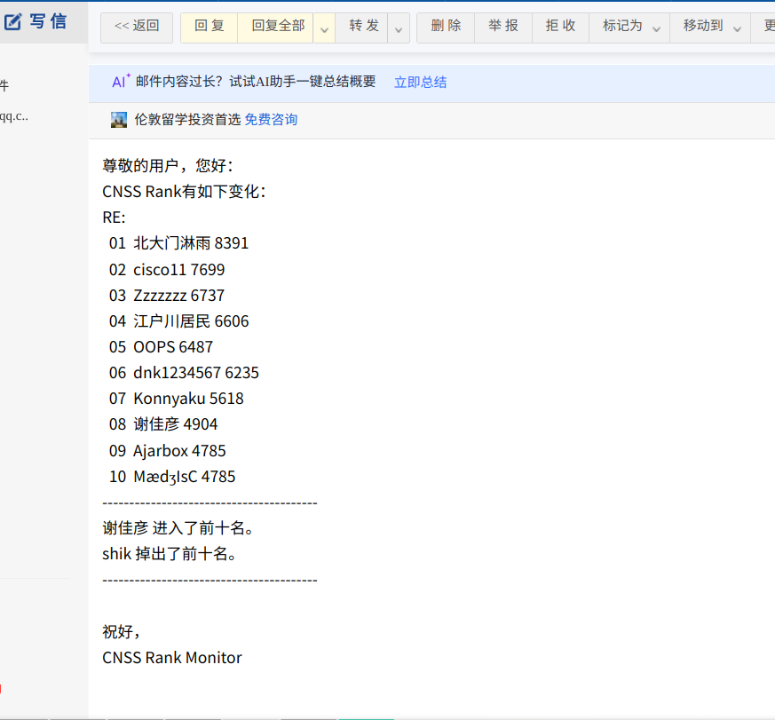
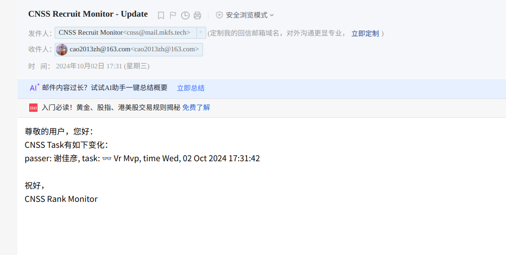
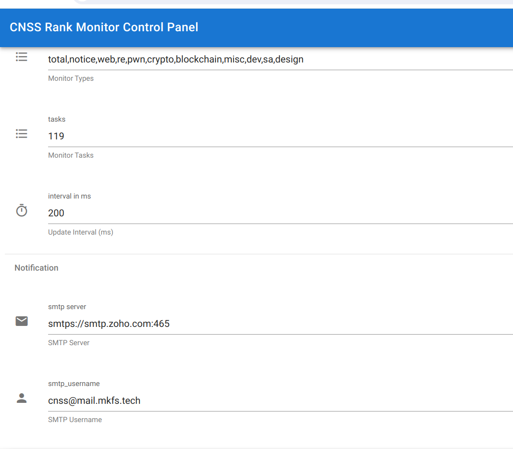

# CNSS Rank Monitor

A rank monitor for a task in CNSS Recruit 2024.

## DEMO

### Rank



### Task



### Control Panel


## Setup
Here is the `config.json`
```json
{
  "monitor": {
    "server": "https://recruit.cnss.io:8443",
    "token": "",
    "types": [
      "total",
      "notice",
      "web",
      "re",
      "pwn",
      "crypto",
      "blockchain",
      "misc",
      "dev",
      "sa",
      "design"
    ],
    "tasks": [],
    "interval_in_ms": 200
  },
  "server": {
    "addr": "0.0.0.0",
    "port": 8080,
    "resource_path": "../res",
    "admin_password": ""
  },
  "notification": {
    "smtp": {
      "server": "",
      "username": "",
      "password": "",
      "sender_email": "",
      "receiver_emails": []
    }
  }
}
```
- `token`为浏览器登陆CNSS时获取的，这个没法自动获取，因为网站登陆有Cloudflare的验证码。
- `types`为需要监视的方向
- `tasks`为需要监视的题目
- `resource_path`为`res`文件夹，可以填服务器工作路径的相对位置
- 邮件通知需要有一个支持SMTP的邮箱，上面的在线示例我用了ZOHO的域名邮箱(需要一个域名)。

## Task

### 👿busin的野心

> busin是一个非常全能型的CTF选手，在2023年AK了全部的招新题目后，他又回来了。

为了合理的安排做题策略，他需要随时查看招新网站上的排行榜来确定自己的排名有什么变化。  

但是如果随时随地查看排行榜就太麻烦了。于是他找到了正在钻研dev领域的你，想请你写个程序，自动检测排行榜的变化，这样他就不用手动打开 summer.cnss.io 来看自己的rank1有没有被人夺走了😋

具体来说，有如下两个需求：

1. 招新网站的排行榜包含 10个招新相关方向以及一个 总分方向。如果这11个类别中的任意一个排行的前十名 发生了变化，程序就会打印:
    - 新的前十名排行 
    - 哪一个人掉出了前十名
    - 哪一个人进入了前十名。

2. 因为 题目的分数会随着通过的人数动态变化，因此针对一些特定的题目，busin还想知道有哪些人通过了这个题目。因此程序应该监测特定的题目（使用动态容器的题目可以不被监测），当有人通过了这个题目后，程序会按照  
`f"passer: {user_name}, task: {task_name}, time: {passing_time}"`  
打印出这条信息。

#### ❓ 得分细则
1. 完成第一个需求你可以得到35%的分数
2. 完成第二个需求你可以得到65%的分数
3. 将程序部署在服务器上实现24h运行，并能通过社交软件\邮箱\其他能从移动设备上接收到更新信息的方式 将信息发送到你的移动设备上，会根据完成程度给额外的50%分数 (ps:这可能需要一点SA的知识）  
4. 实现可视化的管理界面 会根据完成程度给额外的50%分数。

#### ✍ 提交要求 
完成题目后将如下内容 用 Markdown 写完后导出为 pdf，统一命名为`[CNSS Recruit] 用户名 - 题目名称` 发送至 `2716776569@qq.com`：
- 你的解答